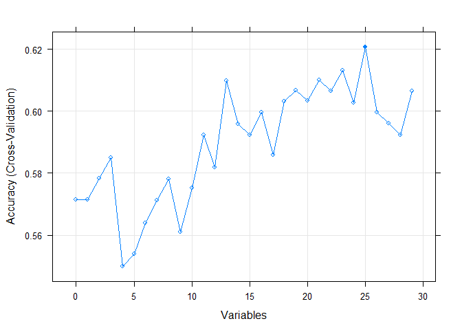

-   [Overview and Notions](#overview-and-notions)
-   [Preparation steps](#preparation-steps)
    -   [Data](#data)
    -   [Packages](#packages)
-   [Model Preparation](#model-preparation)
    -   [Initial State Probabilities](#initial-state-probabilities)
    -   [Transition Matrices and
        Tensors](#transition-matrices-and-tensors)
        -   [Transition Tensor for 2nd-order
            Models](#transition-tensor-for-2nd-order-models)
-   [Model Evaluation](#model-evaluation)
    -   [Most important Variables](#most-important-variables)
    -   [Stateless Models](#stateless-models)
        -   [Computation of 3rd-Party
            Models](#computation-of-3rd-party-models)
        -   [Computation of conditional Density
            Models](#computation-of-conditional-density-models)
    -   [Stateful Models](#stateful-models)
        -   [Pseudo-stateful 3rd-party
            Models](#pseudo-stateful-3rd-party-models)

    source("../models/depmix.R")
    source("../models/conddens.R")

Overview and Notions
====================

We use these notions:

-   **a** – a vector,
-   **A** – a matrix,
-   A – a tensor

Preparation steps
=================

Data
----

We need to prepare 0th-, 1st-, and 2nd-order datasets, conditioned on
the kind of preceding commit. There are extra functions to get those
datasets.

Packages
--------

We will need a version of `mmb` for this, and we take an early but
stable version by referring to a specific commit ID.

Model Preparation
=================

In this section, we will prepare initial state probability
vectors/matrices and transition matrices/tensors. These are needed for
the dependent mixture models. In the joint conditional density models,
we only use initial state probabilities conditionally (we test with and
without).

Initial State Probabilities
---------------------------

When we define (1st-order) dependent mixture models, then there is a
finite set of states 𝒮 = {*a*, *c*, *p*} (corresponding to the
maintenance activities of commits and summing to one), a vector
**π** ∈ ℛ∥*S*∥ of initial state probabilities.

The intial probabilities are, regardless of the order of the model,
always build from the *t* − 0 (zeroth-order) commits, so we can always
use the dataset `commits_t0`. In other words, each model, regardless of
its order, uses the same *ϕ*1(*j*) with the same **π**, so
that we only need to generate this once.

    initProbs <- c(
      a = nrow(commits_t0[commits_t0$label_t_0 == "a", ]),
      c = nrow(commits_t0[commits_t0$label_t_0 == "c", ]),
      p = nrow(commits_t0[commits_t0$label_t_0 == "p", ])
    ) / nrow(commits_t0)

    print(initProbs)

    ##         a         c         p 
    ## 0.2160279 0.2369338 0.5470383

Transition Matrices and Tensors
-------------------------------

With increasing order, models require tensors with higher order for
their transitions. For a 1st-order model, this order is 2 (a quadratic
matrix actually). If more than one previous state is considered, then
the matrix becomes a tensor of order 1 + number of previous states
considered (ℛ3 for a 2nd-order model).

Every model’s *ϕ*2(*j*) depends on the likelihood of the
current state and its previous state, hence we need transition
probabilities. Hence, *ϕ*’s order corresponds to the order of this
tensor. So, for capturing transitions between two consecutive states,
that order is two, and results in a matrix. For transitions between
three states (a 2nd-order model), this becomes a 3-dimensional tensor.
Any of these matrices or tensors always sum to the amount of possible
start states, as the sum of probabilities of possible transitions from
any state *j* is 1. On each axis of these matrices or tensors we find
each possible state (here: 𝒮 = {*a*, *c*, *p*}), so that the size of
this matrix/tensor is ℛ∥*S*∥*T* + 1 (where *T* is
the order of the model).

Similar to the initial state probabilities, we define a matrix for all
*ϕ*2(*j*), and a tensor for all *ϕ*3(*j*) (as we
are only evaluating 1st- and 2nd-order models). *ϕ*3(*j*) is
then used as *ϕ**t*(*j*) in 2nd-order models (and similarly,
*ϕ*2(*j*) is used as *ϕ**t*(*j*) in 1st-order
models).

As a convention, the dimensions in these matrices and tensors are
ordered from most recent to oldest, i.e.,
**A***t*0, *t* − 1, …, *t* − *T*.
This means that we can query similar to “.. what is the probability of
*t*0, given that we were in *t* − 1 before and
*t* − 2 befor that?” using that notion.

    transprobs_1stOrder <- matrix(data = 0, nrow = 3, ncol = 3)
    colnames(transprobs_1stOrder) <- levels(commits_t1$label_t_0)
    rownames(transprobs_1stOrder) <- levels(commits_t1$label_t_0)

    for (t_1 in levels(commits_t1$label_t_1)) { # column-wise
      for (t_0 in levels(commits_t1$label_t_1)) {
        # Sum how often we went from t_1 to t_0
        transprobs_1stOrder[t_0, t_1] <- transprobs_1stOrder[t_0, t_1] +
          sum(commits_t1$label_t_1 == t_1 & commits_t1$label_t_0 == t_0)
      }
      
      # Normalize all options for ending up in t_0 coming from t_1:
      transprobs_1stOrder[, t_1] <- transprobs_1stOrder[, t_1] /
        sum(transprobs_1stOrder[, t_1])
    }

    print(transprobs_1stOrder)

    ##           a         c         p
    ## a 0.3965517 0.1250000 0.1311475
    ## c 0.2758621 0.4107143 0.1475410
    ## p 0.3275862 0.4642857 0.7213115

As an example, to go over `p` to `a` (or to end up in `a` having gone
over `p`), we select the transition probability as 0.1311475. For any
higher-dimension tensors, we prepend dimensions, so that we can follow
this scheme (going over .. to ..).

### Transition Tensor for 2nd-order Models

We do this in an extra section as we will work with actual tensors and
the initialization is a bit different. We stick to the same indexing
convention as for 2D-matrices.

    install.packagesCond("tensorr")
    library("tensorr")

    ## Warning: package 'tensorr' was built under R version 3.6.3

    ## 
    ## Attaching package: 'tensorr'

    ## The following object is masked from 'package:base':
    ## 
    ##     norm

    # Create a dense 3x3x3 tensor
    transprobs_2ndOrder <- dtensor(array(data = 0, dim = c(3,3,3)))
    dimnames(transprobs_2ndOrder) <-
      list(levels(commits_t0$label_t_0), levels(commits_t0$label_t_0), levels(commits_t0$label_t_0))

    # Now let's fill the tensor using a numeric mapping a=1, c=2, p=3:
    m <- c("a" = 1, "c" = 2, "p" = 3)
    for (t_2 in levels(commits_t2$label_t_2)) {
      i2 <- m[t_2]
      for (t_1 in levels(commits_t2$label_t_1)) {
        i1 <- m[t_1]
        for (t_0 in levels(commits_t2$label_t_0)) {
          i0 <- m[t_0]
          
          # Sum how often we went from t_2, over t_1, to t_0
          transprobs_2ndOrder[i0, i1, i2] <- transprobs_2ndOrder[i0, i1, i2] +
            sum(commits_t2$label_t_2 == t_2 &
                commits_t2$label_t_1 == t_1 &
                commits_t2$label_t_0 == t_0)
        }
      }
      
      # Normalize each 3x3x1 tensor:
      n <- transprobs_2ndOrder[,, i2] / sum(transprobs_2ndOrder[,, i2])
      transprobs_2ndOrder[,, i2] <- array(n, dim = dim(n))
    }

    #transprobs_2ndOrder <- transprobs_2ndOrder / sum(transprobs_2ndOrder)
    print(transprobs_2ndOrder)

    ## <A 3x3x3 dense tensor>
    ## , , a
    ## 
    ##      a    c    p
    ## a 0.12 0.00 0.08
    ## c 0.14 0.06 0.02
    ## p 0.18 0.20 0.20
    ## 
    ## , , c
    ## 
    ##            a          c          p
    ## a 0.04651163 0.04651163 0.02325581
    ## c 0.06976744 0.20930233 0.04651163
    ## p 0.04651163 0.16279070 0.34883721
    ## 
    ## , , p
    ## 
    ##            a          c          p
    ## a 0.06521739 0.03260870 0.06521739
    ## c 0.05434783 0.03260870 0.13043478
    ## p 0.02173913 0.08695652 0.51086957

As an example, to go from `p` to `c` and then `a`, we call
`transprobs_2ndOrder[m["a"], m["c"], m["p"]]`, and the probability is
0.0326087. We have to use the `m[label]`-notation, as indexing of
dimensions does not work on other dimensions other than the last for
some reason.

Model Evaluation
================

We want to evaluate *depmix*- and *conddens*-models and check their
classification accuracy. However, we can separate all tests to those
that require consecutive commits (chains with proper relations) for
inferencing, and those that do not.

Models that can be evaluated as stateless classifiers:

-   condDens models B and C
-   models supported by `mmb`
-   other models, such as Random forest

Models that require consecutive observations for evaluation:

-   all depmix models
-   condDens model A

For stateless models, we will do a classic cross-validation. For
stateful models, we will train using all but one of the available chains
of observations, and then inference on that remaining chain.

We will only train and evaluate cross-project models (mainly because we
don’t have much data).

Most important Variables
------------------------

Furthermore, we are applying Recursive Feature Elimination (RFE) to find
the most important features. We search among the `t_0`-features and will
assume that any `t_n`-features of preceding commits have a comparable
impact on classification performance.

We will be doing an RFE using the `commit_t0` dataset. Across all
datasets of commits we ignore these columns:

    # Mostly columns that could be used to identify a column. Note that
    # we keep "label", as it'll be removed for inferencing only.
    ignoreCols <- c(
      "project", # because of scarce data, we train and evaluate only cross-project
      "commitId",
      "labelledBefore",
      "reasonOrRule",
      "RepoPathOrUrl",
      "CommitterName",
      "CommitterTime",
      "CommitterEmail",
      "CommitterNominalLabel",
      "ParentCommitSHA1s",
      "Message",
      "branch",
      "SHA1",
      "AuthorName",
      "AuthorTime",
      "AuthorEmail",
      "AuthorNominalLabel"
    )

Let’s do the RFE:

    install.packagesCond("doParallel")
    library(doParallel)

    ## Loading required package: foreach

    ## Loading required package: iterators

    ## Loading required package: parallel

    install.packagesCond("caret")
    library(caret)

    ## Loading required package: lattice

    ## Loading required package: ggplot2

    install.packagesCond("mlbench")
    library(mlbench)
    install.packagesCond("randomForest")
    library(randomForest)

    ## randomForest 4.6-14

    ## Type rfNews() to see new features/changes/bug fixes.

    ## 
    ## Attaching package: 'randomForest'

    ## The following object is masked from 'package:ggplot2':
    ## 
    ##     margin

    resultsRfeFile <- "../results/resultsRfe.rds"
    if (file.exists(resultsRfeFile)) {
      resultsRfe <- readRDS(resultsRfeFile)
      resultsRfe$X <- NULL
    } else {
      resultsRfe <- doRfe(
        data = commits_t0[, !grepAnyOrAll(ignoreCols, cn)],
        y = commits_t0$label_t_0,
        yColName = "label_t_0")
      saveRDS(resultsRfe, resultsRfeFile)
    }

    plot(resultsRfe, type = c("g", "o"))

    print(caret::predictors(resultsRfe))

    ##  [1] "NumberOfLinesAddedByAddedFiles_t_0"        
    ##  [2] "NumberOfLinesAddedByAddedFilesNet_t_0"     
    ##  [3] "NumberOfLinesAddedByModifiedFilesNet_t_0"  
    ##  [4] "NumberOfLinesDeletedByModifiedFiles_t_0"   
    ##  [5] "AffectedFilesRatioNet_t_0"                 
    ##  [6] "NumberOfLinesDeletedByModifiedFilesNet_t_0"
    ##  [7] "NumberOfLinesAddedByModifiedFiles_t_0"     
    ##  [8] "NumberOfFilesAdded_t_0"                    
    ##  [9] "NumberOfFilesAddedNet_t_0"                 
    ## [10] "Density_t_0"                               
    ## [11] "NumberOfFilesRenamed_t_0"                  
    ## [12] "NumberOfFilesModifiedNet_t_0"              
    ## [13] "NumberOfLinesDeletedByRenamedFiles_t_0"    
    ## [14] "NumberOfLinesAddedByRenamedFiles_t_0"      
    ## [15] "NumberOfLinesDeletedByRenamedFilesNet_t_0" 
    ## [16] "NumberOfLinesAddedByRenamedFilesNet_t_0"   
    ## [17] "NumberOfFilesRenamedNet_t_0"               
    ## [18] "NumberOfFilesModified_t_0"                 
    ## [19] "MinutesSincePreviousCommit_t_0"            
    ## [20] "NumberOfFilesDeleted_t_0"                  
    ## [21] "NumberOfLinesDeletedByDeletedFilesNet_t_0" 
    ## [22] "NumberOfFilesDeletedNet_t_0"               
    ## [23] "NumberOfLinesDeletedByDeletedFiles_t_0"    
    ## [24] "precByMerge_t_0"                           
    ## [25] "isInitial_t_0"

Stateless Models
----------------

For each dataset (`commits_t0`, `commits_t1`, `commits_t2`,
`commits_t2`) we do a separate RFE, and then we do the following:

-   Re-order the dataset’s columns by importance of the features.
-   For all 3rd-parts models we train using a repeated cross validation,
    using caret and a split of `0.8`.
-   For conditional-density models, we keep the same kind of variables
    in every generation and perform also a cross validation. We use the
    same split.
    -   Note we cannot use `t0`-datasets for these models, as there are
        no relations. However, we can compare our first- and
        second-order models’ performance to the 3rd-party models that
        use `t0`-data.
    -   Note that only model **B** supports a **3rd**-order.

### Computation of 3rd-Party Models

Since we have transformed our problem into one suitable for stateless
classifiers, we will attempt using some of them so that we can compare
their results and performance later.

The 3rd-party models are these:

    install.packagesCond("randomForest")
    install.packagesCond("e1071")
    install.packagesCond("ranger")
    install.packagesCond("dplyr")
    install.packagesCond("plyr")
    install.packagesCond("gbm")
    install.packagesCond("naivebayes")
    install.packagesCond("C50")

    # bayesCaret refers to mmb-models!
    caret_models <- c(#"bayesCaret")#, 
      "null", "rf", "ranger", "gbm", "naive_bayes", "C5.0")

Let’s do the computation!

    stateless_folds = 5
    stateless_repeats = 3
    results_stateless <- data.frame()

    resFile <- paste0("../results/stateless.csv")
    if (file.exists(resFile)) {
      temp <- read.csv(resFile)
      temp$X <- NULL
      results_stateless <- rbind(results_stateless, temp)
    } else {
      doWithParallelCluster({
        for (idx in c(0:3)) {
          yColName <- paste0("label_t_", idx)
          data <- .GlobalEnv[[paste0("commits_t", idx)]]
          # Compute it!
          rfe <- doRfe(
            data = data,
            y = data[[yColName]],
            yColName = "^label_t_",
            ignoreCols = ignoreCols,
            number = stateless_folds, repeats = stateless_repeats)
          
          useVars <- predictors(rfe)
          plot(rfe, type = c("g", "o"))
          
          # Let's reorder the dataset:
          data <- data[, c(yColName, useVars)]
          
          for (modelName in caret_models) {
            trainedModel <- evaluateStatelessModel(
              ds = data, modelName = modelName, yColName = yColName, trP = 0.8,
              rcvNumber = stateless_folds, rcvRepeats = stateless_repeats)
            result <- trainedModel$results[which.max(trainedModel$results$Accuracy), ]
            
            results_stateless <- rbind(results_stateless, data.frame(
              vars = length(useVars),
              t = idx,
              model = modelName,
              acc = result$Accuracy,
              kappa = result$Kappa
            ))
          }
        }
      })
      
      write.csv(results_stateless, resFile)
    }

    print(results_stateless)

    ##    vars t       model       acc     kappa
    ## 1    28 0        null 0.5470458 0.0000000
    ## 2    28 0          rf 0.5970357 0.2885070
    ## 3    28 0      ranger 0.5946562 0.2836553
    ## 4    28 0         gbm 0.5970962 0.2867168
    ## 5    28 0 naive_bayes 0.3378302 0.1140860
    ## 6    28 0        C5.0 0.5946965 0.2985177
    ## 7    14 1        null 0.5169962 0.0000000
    ## 8    14 1          rf 0.6050254 0.2910743
    ## 9    14 1      ranger 0.6163458 0.2777852
    ## 10   14 1         gbm 0.5882035 0.2998195
    ## 11   14 1 naive_bayes 0.3843972 0.1717195
    ## 12   14 1        C5.0 0.5892374 0.2713622
    ## 13   39 2        null 0.4972973 0.0000000
    ## 14   39 2          rf 0.6270218 0.3321567
    ## 15   39 2      ranger 0.6502055 0.4217356
    ## 16   39 2         gbm 0.5912096 0.3317876
    ## 17   39 2 naive_bayes 0.3438570 0.1287544
    ## 18   39 2        C5.0 0.5960803 0.3418377
    ## 19   11 3        null 0.5000000 0.0000000
    ## 20   11 3          rf 0.6415005 0.4087702
    ## 21   11 3      ranger 0.6267806 0.3817444
    ## 22   11 3         gbm 0.6192783 0.3686474
    ## 23   11 3 naive_bayes 0.3657170 0.1623451
    ## 24   11 3        C5.0 0.5891738 0.3231553

### Computation of conditional Density Models

We will train the conditional density models separately, because we do
not have a caret-compatible wrapper at this moment. Caret did an
n-repeated, k-fold cross validation with all the data, using a split of
`0.8`. We will do the same, n\*k times, withholding 20% of the data at
every turn. Then we predict it and average the results. Additionally, we
will do this for the `doEcdf`-parameter.

    perms <- rbind(
      expand.grid(
        t = 1:3,
        doEcdf = c(TRUE, FALSE),
        rfeVars = c(TRUE, FALSE), # Use RFE-filtered variables or ALL
        resample = 1:(stateless_folds * stateless_repeats),
        model = c("B1", "B2", "B3")
      ),
      expand.grid(
        t = 1:2,
        doEcdf = c(TRUE, FALSE),
        rfeVars = c(TRUE, FALSE),
        resample = 1:(stateless_folds * stateless_repeats),
        model = c("C1", "C2")
      )
    )

    permsRfe <- doWithParallelCluster({
      foreach::foreach(
        indexes = 1:3,
        .packages = c("parallel", "doParallel")
      ) %dopar% {
        clNested <- makePSOCKcluster(max(2, detectCores() / 2))
        registerDoParallel(clNested)
        idx <- indexes
        
        yColName <- paste0("label_t_", idx)
        data <- if (idx == 1) commits_t1 else if (idx == 2) commits_t2 else commits_t3

        # Compute it!
        temp <- doRfe(
          data = data,
          y = data[[yColName]],
          yColName = "^label_t_",
          ignoreCols = ignoreCols,
          number = stateless_folds, repeats = stateless_repeats, maxSize = 100)
        
        stopCluster(clNested)
        temp
      }
    })

Let’s show those RFE plots:

    for (n in 1:length(permsRfe)) {
      plot(permsRfe[[n]], type=c("o","g"))
    }

    results_stateless_conddens <- data.frame()
    resFileConddens <- paste0("../results/stateless_cd.csv")
    if (file.exists(resFileConddens)) {
      temp <- read.csv(resFileConddens)
      temp$X <- NULL
      results_stateless_conddens <- temp
    } else {
      results_stateless_conddens <- doWithParallelCluster({
        foreach::foreach(
          permRowIdx = rownames(perms),
          .combine = rbind,
          .packages = c("caret")
        ) %dopar% {
          permRow <- perms[permRowIdx, ]
          permRfe <- permsRfe[[permRow$t]]
          
          t <- permRow$t
          doEcdf <- permRow$doEcdf
          rfeVars <- permRow$rfeVars
          resamp <- permRow$resample
          mType <- permRow$model
          
          model <- if (mType == "B1") condDens_B_1stOrder else if
          (mType == "B2") condDens_B_2ndOrder else if
          (mType == "B3") condDens_B_3rdOrder else if
          (mType == "C1") condDens_C_1stOrder else if
          (mType == "C2") condDens_C_2ndOrder else stop(paste("Model not known:", mType))
          
          data <- if (t == 1) commits_t1 else if (t == 2) commits_t2 else commits_t3
          
          # Use all variables for estimating densities and probabilities
          # or just those left after RFE?
          useVars <- if (rfeVars) predictors(permRfe) else colnames(data)
        
          # Take all variables used by rfe, in each generation.
          # Note that these will not be ordered (which is not required)
          # We need to include the labels for our models so they can
          # build conditional densities.
          temp <- c("label_t_", "MinutesSince", unique(gsub("_t_\\d+$", "", useVars)))
          data <- data[, colnames(data)[grepAnyOrAll(
            patterns = temp, subjects = colnames(data))]]
          
          # Split data to train and validation:
          set.seed(t * resamp)
          p <- caret::createDataPartition(data[["label_t_0"]], p = 0.8, list = FALSE)
          train <- data[p, ]
          valid <- data[-p, ]
          
          truth <- valid[, "label_t_0"]
          pred <- model(
            states = states,
            data = train,
            observations = valid,
            stateColumn = "label_t_0",
            doEcdf = doEcdf)
          
          cm <- caret::confusionMatrix(truth, factor(pred, levels = levels(truth)))
          
          cbind(permRow, data.frame(
            vars = length(temp),
            acc = cm$overall[[1]],
            kappa = cm$overall[[2]]
          ))
        }
      })
      
      write.csv(results_stateless_conddens, resFileConddens)
    }

Todo: We need to add some plots here later!

Stateful Models
---------------

In this section, we dedicate some effort into testing the Dependent
Mixture Models (depmix), as well as some stateful models that facilitate
conditional density.

We have a number of consecutively labeled chains of commits. Since
stateful models require going from one commit to the next, we will
attempt inferencing each chain individually. The chains are differently
long and belong to different projects, so we have some kind of cross
validation.

First we get all chains. Then, for each change, we will take the entire
dataset and splice out the commits on the chain, thereby separating into
training and validation data.

    treeXL <- getDataset("rq5_treex", removeUnwantedColums = FALSE)
    treeXChains <- buildObservationChains(
      data = treeXL, idCol = "commitId", parentIdCol = "ParentCommitSHA1s")

    permsStateful <- rbind(
      expand.grid(
        t = 1,
        doEcdf = c(TRUE, FALSE),
        rfeVars = c(TRUE, FALSE), # Use RFE-filtered variables or ALL
        resample = 1:(stateless_folds * stateless_repeats),
        model = c("A1", "depmix1")
      ),
      expand.grid(
        t = 2,
        doEcdf = c(TRUE, FALSE),
        rfeVars = c(TRUE, FALSE), # Use RFE-filtered variables or ALL
        resample = 1:(stateless_folds * stateless_repeats),
        model = c("A2", "depmix2")
      )
    )

    results_statefull <- data.frame()
    resFileStatefull <- paste0("../results/statefull.csv")
    if (file.exists(resFileStatefull)) {
      temp <- read.csv(resFileStatefull)
      temp$X <- NULL
      results_statefull <- temp
    } else {
      results_statefull <- doWithParallelCluster({
        foreach::foreach(
          permRowIdx = rownames(permsStateful),
          .combine = rbind,
          .packages = c("caret")
        ) %dopar% {
          permRow <- permsStateful[permRowIdx, ]
          permRfe <- permsRfe[[permRow$t]]
          
          t <- permRow$t
          doEcdf <- permRow$doEcdf
          rfeVars <- permRow$rfeVars
          resamp <- permRow$resample
          mType <- permRow$model
          
          tryCatch({
            
            model <- if (mType == "A1") condDens_A_1stOrder else if
            (mType == "A2") condDens_A_2ndOrder else if
            (mType == "depmix1") depmixForward_1stOrder else if
            (mType == "depmix2") depmixForward_2ndOrder else stop(paste("Model not known:", mType))
            
            data <- if (t == 1) commits_t1[, ] else commits_t2[, ]
            lvl <- levels(data[["label_t_0"]])
            data[["label_t_0"]] <- as.character(data[["label_t_0"]])
            
            # Use all variables for estimating densities and probabilities
            # or just those left after RFE?
            useVars <- if (rfeVars) predictors(permRfe) else colnames(data)
            
            
            # We should take 0.8 of the data for training, and
            # the rest for inferencing. However, we can only take
            # data chain-wise. So we'll start and inferencing chain
            # by chain and stop once we have at least taken 0.2%.
            # We'll take random chains.
            
            set.seed(t * resamp)
            chainNames <- sample(names(treeXChains))
      
            dataLen <- nrow(data)
            pred <- c()
            truth <- c()
            
            chainIdx <- 1
            
            while (TRUE) {
              if (nrow(data) <= dataLen * 0.8) {
                break
              }
              
              nextChain <- chainNames[chainIdx]
              
              ## Now instead of train/validation, we have all commits
              ## but those on the currently selected chain.
              trainValid <- extractChain(
                data = data, idColData = "commitId_t_0", idColChain = "commitId",
                t = t, chains = treeXChains, chainId = nextChain)
              train <- trainValid$data
              valid <- trainValid$obs
              
              data <- trainValid$data
              chainIdx <- chainIdx + 1
              
              # Take all variables used by rfe, in each generation.
              # Note that these will not be ordered (which is not required)
              # We need to include the labels for our models so they can
              # build conditional densities.
              temp <- c("label_t_", "MinutesSince", unique(gsub("_t_\\d+$", "", useVars)))
              train <- train[, colnames(train)[grepAnyOrAll(
                patterns = temp, subjects = colnames(train))]]
              valid <- valid[, colnames(valid)[grepAnyOrAll(
                patterns = temp, subjects = colnames(valid))]]
              
              truth <- c(truth, valid[, "label_t_0"])
              # Remove the label from valid, to avoid the special cases
              # for depmix models.
              valid[["label_t_0"]] <- ""
              
              pred <- c(pred, model(
                states = states,
                data = train,
                observations = valid,
                stateColumn = "label_t_0",
                doEcdf = doEcdf))
            }
            
            truth <- factor(truth, levels = lvl)
            pred <- factor(pred, levels = lvl)
            cm <- caret::confusionMatrix(truth, pred)
            
            cbind(permRow, data.frame(
              vars = length(temp),
              acc = cm$overall[[1]],
              kappa = cm$overall[[2]],
              numChains = chainIdx - 1,
              nrowData = nrow(data),
              truth = paste(truth, collapse = ","),
              pred = paste(pred, collapse = ",")
            ))
          }, error=function(cond) {
            stop(paste(t, doEcdf, rfeVars, resamp, mType, cond))
          })
        }
      })
      
      write.csv(results_statefull, resFileStatefull)
    }

### Pseudo-stateful 3rd-party Models

In this section, we create the data as it is used internally by the
joint conditional density models that segment over one or more
generations of parents and estimate densities over the current
generation’s variables.

Here however, we do this only by segmenting over the previous
generation. For each label, we train a separate model. Later, we combine
the votes of these models by averaging.

    install.packagesCond("neuralnet")
    library(neuralnet)

    ## Warning: package 'neuralnet' was built under R version 3.6.3

    set.seed(847321)
    p <- caret::createDataPartition(commits_t1[["label_t_0"]], p = 0.8, list = FALSE)
    train <- commits_t1[p, ]
    valid <- commits_t1[-p, ]

    # We'll store the neural nets in this list.
    # We need one model per label.
    prevModels <- list()
    lvls <- levels(commits_t1$label_t_0)
    for (lvl in lvls) {
      tempData <- train[train$label_t_1 == lvl, ]
      tempData <- tempData[, !grepAnyOrAll(c(ignoreCols, "t_1$"), colnames(tempData))]
      
      # We need those for one-hot encoding:
      tempData$isA <- sapply(tempData$label_t_0, function(l) if (l == "a") 1 else 0)
      tempData$isC <- sapply(tempData$label_t_0, function(l) if (l == "c") 1 else 0)
      tempData$isP <- sapply(tempData$label_t_0, function(l) if (l == "p") 1 else 0)
      # Remove the label (we use the one-hot now):
      tempData$label_t_0 <- NULL
      
      set.seed(1337)
      tempNet <- neuralnet::neuralnet(
        formula = isA + isC + isP ~.,
        data = tempData, hidden = c(3))
      
      prevModels[[lvl]] <- tempNet
    }

    # Prepare the validation data, too:
    validGroundTruth <- sapply(valid$label_t_0, function(l) {
      if (l == "a") return(1)
      if (l == "c") return(2)
      return(3)
    })

    valid <- valid[, !grepAnyOrAll(c(ignoreCols, "t_1$"), colnames(valid))]
    valid$label_t_0 <- NULL

Let’s do some inferencing. Note that, depending on the random seed, the
train and validation sets differ greatly, and the following inferencing
typically results in ~55% accuracy, with the lowest about 45%, and the
highest around 63% (Kappa 0.3). This is still a bit lower compared with
where the other 3rd-party models max out.

    # We'll combine predictions by adding them together, then returning
    # which output was max.

    predTempA <- predict(prevModels[["a"]], newdata = valid)
    predTempC <- predict(prevModels[["c"]], newdata = valid)
    predTempP <- predict(prevModels[["p"]], newdata = valid)

    predTemp <- predTempA + predTempC + predTempP
    predTruth <- unname(apply(predTemp, 1, which.max))

    caret::confusionMatrix(
      factor(predTruth, levels = c(1,2,3)),
      factor(validGroundTruth, levels = c(1,2,3)))

    ## Confusion Matrix and Statistics
    ## 
    ##           Reference
    ## Prediction  1  2  3
    ##          1  5  3  1
    ##          2  0  1  2
    ##          3  4  7 23
    ## 
    ## Overall Statistics
    ##                                           
    ##                Accuracy : 0.6304          
    ##                  95% CI : (0.4755, 0.7679)
    ##     No Information Rate : 0.5652          
    ##     P-Value [Acc > NIR] : 0.22966         
    ##                                           
    ##                   Kappa : 0.3005          
    ##                                           
    ##  Mcnemar's Test P-Value : 0.05559         
    ## 
    ## Statistics by Class:
    ## 
    ##                      Class: 1 Class: 2 Class: 3
    ## Sensitivity            0.5556  0.09091   0.8846
    ## Specificity            0.8919  0.94286   0.4500
    ## Pos Pred Value         0.5556  0.33333   0.6765
    ## Neg Pred Value         0.8919  0.76744   0.7500
    ## Prevalence             0.1957  0.23913   0.5652
    ## Detection Rate         0.1087  0.02174   0.5000
    ## Detection Prevalence   0.1957  0.06522   0.7391
    ## Balanced Accuracy      0.7237  0.51688   0.6673

Let’s do the same, but this time we take the maximum value across all
three models instead of averaging:

    predTemp <- cbind(predTempA, predTempC, predTempP)
    predTruth <- unname(apply(predTemp, 1, function(row) {
      m <- which.max(row) %% 3
      return(if (m == 0) 3 else m)
    }))

    caret::confusionMatrix(
      factor(predTruth, levels = c(1,2,3)),
      factor(validGroundTruth, levels = c(1,2,3)))

    ## Confusion Matrix and Statistics
    ## 
    ##           Reference
    ## Prediction  1  2  3
    ##          1  1  1  1
    ##          2  3  2  1
    ##          3  5  8 24
    ## 
    ## Overall Statistics
    ##                                         
    ##                Accuracy : 0.587         
    ##                  95% CI : (0.4323, 0.73)
    ##     No Information Rate : 0.5652        
    ##     P-Value [Acc > NIR] : 0.44352       
    ##                                         
    ##                   Kappa : 0.1762        
    ##                                         
    ##  Mcnemar's Test P-Value : 0.02785       
    ## 
    ## Statistics by Class:
    ## 
    ##                      Class: 1 Class: 2 Class: 3
    ## Sensitivity           0.11111  0.18182   0.9231
    ## Specificity           0.94595  0.88571   0.3500
    ## Pos Pred Value        0.33333  0.33333   0.6486
    ## Neg Pred Value        0.81395  0.77500   0.7778
    ## Prevalence            0.19565  0.23913   0.5652
    ## Detection Rate        0.02174  0.04348   0.5217
    ## Detection Prevalence  0.06522  0.13043   0.8043
    ## Balanced Accuracy     0.52853  0.53377   0.6365
